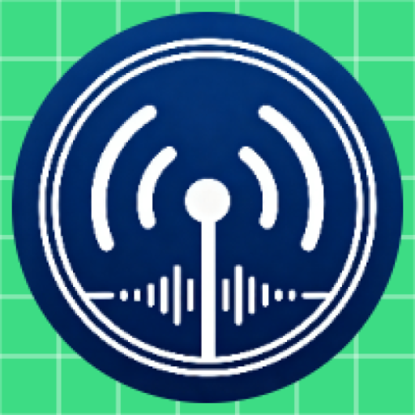

#  HamRadioTools

[中文](#中文) ｜ [日本語](#日本語) ｜ [English](#english)

## 中文

HamRadioTools 是一款跑在 Android 上的业余无线电小工具，给火腿在架台、通联前后用。
现场算个天线方位角和大圆距离、把经纬度敲成梅登黑德网格、或者直接跳转到地图 App
看目标点位置，都在这一个 App 里完成。

### 它解决什么问题

野外架台或者坐在电台前，最常见的几个动作：知道友台或者卫星的经纬度，想知道天线
该朝哪个方向、多远；反过来手里只有一个网格号（比如 `BL11aa`），想知道它大概在哪；
出门前想快速在常用地图上钉个点。这些事以前要切好几个网页和计算器，这个 App 把
它们收到一起，并且调起本机 GPS 和磁力计，省得手敲自己的位置。

### 核心功能

- **天线指向计算**：本机 GPS 取当前位置，输入目标经纬度，用半正矢公式（haversine）
  算大圆距离和初始方位角；方位角同时转成 16 个罗经点的方向文本（N、NE、ENE……）。
- **指南针辅助**：通过 `SensorManager` 的旋转矢量传感器（由加速度计与磁力计融合得到）做倾斜补偿，屏幕上指北针跟着方位角转，
  方便在天线边直接对方向。
- **梅登黑德网格双向转换**：经纬度 ↔ 6 位网格（Field 两位字母 A–R + Square 两位数字
  0–9 + Block 两位字母 A–X），含格式校验；反查给出的是格子中心点坐标。
- **多地图跳转**：一键生成链接并调起已安装的地图 App，支持 Google Maps、高德、
  腾讯、百度，以及系统 `geo:` 通用选择器。百度链接按代码里的注释直接拼 WGS84
  坐标，国内使用时如果出现偏移需要自行做坐标系转换。
- **设置页**：存放常用偏好，应用内已经做了中 / 英 / 日三语资源（`values-zh`、
  `values-en`、`values-ja`）。

### 技术栈

- Kotlin + Jetpack Compose + Material 3，导航用 Navigation Compose 2.7.7，图标用
  `material-icons-extended`。
- `compileSdk = 36`，`minSdk = 24`（Android 7.0），`targetSdk = 36`，JVM target 11。
- 包名 / applicationId：`top.hsyscn.hamradiotools`，当前 versionName `1.1`、
  versionCode `2`。
- 定位走系统位置 API，方向走 `SensorManager` 的旋转矢量传感器（加速度计 + 磁力计融合），没有引入额外的
  地图 SDK，所有地图跳转都是生成 URI 后交给系统 Intent。

### 目录结构

```
app/src/main/java/top/hsyscn/hamradiotools/
├── MainActivity.kt               # 单 Activity，Compose 导航入口
├── HamRadioToolsApplication.kt   # Application 子类
├── data/AppSettings.kt           # 设置数据模型
├── manager/SettingsManager.kt    # 设置读写
├── utils/
│   ├── BearingCalculator.kt      # 方位角 / 大圆距离（haversine）
│   ├── CompassManager.kt         # 磁力计 + 加速度计倾角补偿
│   ├── LocationManager.kt        # 系统位置封装
│   ├── MaidenheadLocator.kt      # 经纬度 ↔ 6 位网格
│   ├── MapLinkGenerator.kt       # Google / 高德 / 腾讯 / 百度 / geo: URI
│   └── LocaleHelper.kt           # 应用内语言切换
└── ui/
    ├── SettingsScreen.kt          # 设置页
    └── theme/                     # Compose 主题（Color / Theme / Type）
```

### 构建与运行

用 Android Studio（Hedgehog 或更新版本，需要支持 AGP 8.x 与 Compose Compiler 插件）
打开仓库根目录，等待 Gradle 同步完成后直接 Run 到设备即可。命令行等价做法：

```bash
./gradlew assembleDebug      # 出 debug APK
./gradlew installDebug        # 装到已连接的设备 / 模拟器
```

没有配 NDK，也没有需要手动下载的 SDK 之外组件。

### 系统要求与注意事项

- Android 7.0（API 24）及以上。
- 设备需要有 GPS 和磁力计；指南针在室内或者靠近电台、电源线时读数会飘，最好在
  户外校准后再用。
- 后台持续定位会比普通 App 耗电快，用完建议切出去。

### 版本

- v1.0：初版，含方位角计算、地图跳转、梅登黑德转换。
- v1.1：多配色、应用内中 / 英 / 日三语、设置页。

### 联系

作者：HaohanHe（BI4MIB），个人站 <https://hsyscn.top>。
戴小米手环 Pro / 红米手表 4 等 Vela 设备的朋友，可以看配套的手表端
[Hrt-for-Vela](https://github.com/HaohanHe/Hrt-for-Vela)。

### 许可证

MIT License，详见 [LICENSE](LICENSE)。

---

## 日本語

HamRadioTools は Android 向けのアマチュア無線ツールです。移動運用や自宅の
無線機前で、アンテナの方位角と大円距離をその場で計算したり、緯度経度と
メイデンヘッド・ロケータを相互変換したり、よく使う地図アプリへワンタップで
ジャンプしたりするためのアプリです。

### できること

- **アンテナ方位角の計算**：端末の GPS で現在地を取り、相手局の緯度経度を
  入力すると、ハーバーサイン公式で大円距離と初期方位角を算出します。方位角は
  N / NE / ENE といった 16 方位の文字列にも変換されます。
- **コンパス連携**：`SensorManager` の回転ベクトルセンサー（加速度計と磁気センサーを融合したもの）で傾き補正をかけ、画面上の
  矢印を目標方位に向けます。アンテナの角度合わせにそのまま使えます。
- **メイデンヘッド相互変換**：緯度経度 ⇔ 6 桁ロケータ（Field 2 文字 A–R、
  Square 2 桁 0–9、Block 2 文字 A–X）。フォーマット検証付きで、ロケータから
  戻すと格子の中心点が返ります。
- **地図アプリ連携**：Google Maps、Amap（高徳）、Tencent Maps、Baidu Maps、
  および Android の `geo:` URI を生成し、インストール済みの地図アプリを起動します。
  Baidu のリンクはコード上の注記どおり WGS84 座標のまま組み立てているため、
  中国国内で位置ずれが気になる場合は座標系変換が必要です。
- **設定画面と多言語**：アプリ内リソースは中国語 / 英語 / 日本語の 3 か国語
  （`values-zh` / `values-en` / `values-ja`）を同梱しています。

### 技術構成

- Kotlin + Jetpack Compose + Material 3。ナビゲーションは Navigation Compose
  2.7.7、アイコンは `material-icons-extended` を使用します。
- `compileSdk = 36`、`minSdk = 24`（Android 7.0）、`targetSdk = 36`、
  JVM target は 11 です。
- パッケージ / applicationId は `top.hsyscn.hamradiotools`、versionName `1.1`、
  versionCode `2` です。
- 地図 SDK は追加していません。位置情報は Android の位置 API、方角は
  `SensorManager` の回転ベクトルセンサー（加速度計 + 磁気センサーの融合）でまかない、地図アプリへは URI を
  インテントで渡すだけです。

### ディレクトリ構成

```
app/src/main/java/top/hsyscn/hamradiotools/
├── MainActivity.kt               # シングル Activity、Compose ナビゲーション
├── HamRadioToolsApplication.kt   # Application クラス
├── data/AppSettings.kt           # 設定モデル
├── manager/SettingsManager.kt    # 設定の読み書き
├── utils/
│   ├── BearingCalculator.kt      # 方位角 / 大円距離（ハーバーサイン）
│   ├── CompassManager.kt         # 磁気＋加速度の傾き補正
│   ├── LocationManager.kt        # 位置 API のラッパー
│   ├── MaidenheadLocator.kt      # 緯度経度 ⇔ 6 桁ロケータ
│   ├── MapLinkGenerator.kt       # Google / Amap / Tencent / Baidu / geo:
│   └── LocaleHelper.kt           # アプリ内言語切り替え
└── ui/
    ├── SettingsScreen.kt          # 設定画面
    └── theme/                     # Compose テーマ
```

### ビルドと実行

Android Studio（AGP 8.x と Compose Compiler プラグインに対応したバージョン）で
リポジトリのルートを開き、Gradle の同期が終わったらそのまま Run で端末に
流し込めます。コマンドラインでも同等のことができます。

```bash
./gradlew assembleDebug      # debug APK をビルド
./gradlew installDebug       # 接続中の端末 / エミュレータにインストール
```

NDK は使っておらず、追加で SDK 以外のコンポーネントをダウンロードする必要は
ありません。

### 動作条件と注意点

- Android 7.0（API 24）以上。
- GPS と磁気センサーを搭載した端末が必要です。コンパスは屋内や無線機・
  電源ケーブルの近くでは値がずれるので、屋外で補正してから使ってください。
- 位置情報をバックグラウンドで取り続けると電池の減りが早くなります。
  使い終わったらアプリを閉じることをおすすめします。

### バージョン

- v1.0：最初のリリース。方位角計算、地図連携、メイデンヘッド変換を含みます。
- v1.1：テーマ追加、アプリ内 3 か国語化、設定画面を追加しました。

### 連絡先

作者は HaohanHe（BI4MIB）、個人サイトは <https://hsyscn.top> です。
Xiaomi スマートバンド Pro や Redmi Watch 4 など Vela 端末向けのウォッチアプリ
として [Hrt-for-Vela](https://github.com/HaohanHe/Hrt-for-Vela) も公開して
います。

### ライセンス

MIT License です。詳細は [LICENSE](LICENSE) を参照してください。

---

## English

HamRadioTools is a small Android app for amateur radio operators. It covers the
few things you actually do at the station or in the field: compute an antenna
bearing and great-circle distance from your GPS fix to a target, convert back
and forth between lat/lon and Maidenhead grid, and jump straight into a map app
with the target pinned.

### What it does

- **Bearing and distance**: uses the device GPS for your current position, then
  takes a target lat/lon and returns the great-circle distance and initial
  bearing via the haversine formula. The bearing is also rendered as one of 16
  compass points (N, NE, ENE, ...).
- **Compass overlay**: uses the `SensorManager` rotation-vector sensor (fused from the
  accelerometer and magnetometer) for tilt compensation, so the on-screen needle tracks the
  target bearing while you turn the antenna.
- **Maidenhead conversion**: bidirectional lat/lon to/from a 6-character
  locator (Field A–R, Square 0–9, Block A–X), with format validation. Going
  from a locator back to coordinates returns the center of the square.
- **Map intents**: builds URLs for Google Maps, Amap (Gaode), Tencent Maps, and
  Baidu Maps, plus a generic `geo:` URI so the system picker can handle it.
  The Baidu link uses WGS84 coordinates directly, matching the source comment;
  coordinate-system conversion may be needed inside China.
- **Settings and in-app languages**: preferences live in a settings screen.
  App resources ship in Chinese, English, and Japanese (`values-zh`,
  `values-en`, `values-ja`).

### Stack

- Kotlin, Jetpack Compose, Material 3. Navigation Compose 2.7.7 and
  `material-icons-extended`.
- `compileSdk = 36`, `minSdk = 24` (Android 7.0), `targetSdk = 36`,
  JVM target 11.
- Package / applicationId: `top.hsyscn.hamradiotools`. Current versionName
  `1.1`, versionCode `2`.
- No map SDK is bundled. Position comes from the Android location API, heading
  from the `SensorManager` rotation-vector sensor (accelerometer + magnetometer
  fused), and map apps are reached by firing an intent with a generated URI.

### Layout

```
app/src/main/java/top/hsyscn/hamradiotools/
├── MainActivity.kt               # single-Activity Compose entry
├── HamRadioToolsApplication.kt   # Application subclass
├── data/AppSettings.kt           # settings model
├── manager/SettingsManager.kt    # settings read/write
├── utils/
│   ├── BearingCalculator.kt      # bearing / great-circle distance (haversine)
│   ├── CompassManager.kt         # magnetometer + accelerometer tilt comp
│   ├── LocationManager.kt        # location API wrapper
│   ├── MaidenheadLocator.kt      # lat/lon <-> 6-char locator
│   ├── MapLinkGenerator.kt       # Google / Amap / Tencent / Baidu / geo:
│   └── LocaleHelper.kt           # in-app language switch
└── ui/
    ├── SettingsScreen.kt         # settings screen
    └── theme/                    # Compose theme (Color / Theme / Type)
```

### Build and run

Open the repo root in Android Studio (a version that supports AGP 8.x and the
Compose Compiler plugin), let Gradle sync, then Run onto a device. On the
command line:

```bash
./gradlew assembleDebug      # build a debug APK
./gradlew installDebug       # install to a connected device / emulator
```

No NDK, no extra SDK downloads beyond what Android Studio already manages.

### Requirements and notes

- Android 7.0 (API 24) or newer.
- The device needs a GPS receiver and a magnetometer. The compass reading drifts
  indoors or near rigs and power cables; calibrate outdoors before relying on
  it.
- Continuous background location uses noticeably more battery than a normal app.
  Close it when you are done.

### Releases

- v1.0: initial release with bearing/distance, map intents, and Maidenhead
  conversion.
- v1.1: extra themes, in-app Chinese / English / Japanese, settings screen.

### Contact

Author: HaohanHe (BI4MIB), personal site <https://hsyscn.top>.
If you wear a Xiaomi Smart Band Pro or Redmi Watch 4 series on Vela, there is a
companion watch app: [Hrt-for-Vela](https://github.com/HaohanHe/Hrt-for-Vela).

### License

MIT License, see [LICENSE](LICENSE).
